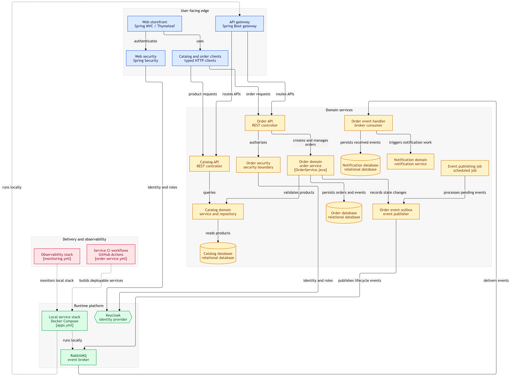
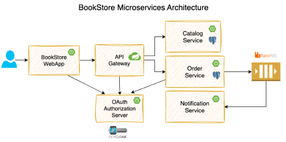

Microservices-based E-commerce Store project

A hands on project to walk through the implementation of a microservices-based e-commerce store. 
This project demonstrates how to build a scalable and maintainable e-commerce application using microservices architecture (especially for someone with no prior experience with Spring Boot).

System Architecture Diagram

Modules
- catalog-service: This service provides REST API for managing catalog of products.
- Stack: Spring Boot, Spring Data JPA, PostgreSQL

- order-service: This service provides the REST API for managing orders and publishes order events to the message broker (RabbitMQ).
- Stack: Spring Boot, Spring Data JPA, PostgreSQL, Spring Security OAuth2, Keycloak, RabbitMQ

- notification-service: This service listens to the order events and sends notifications to the users.
- Stack: Spring Boot, RabbitMQ

- api-gateway: This service is an API Gateway to the internal services (catalog-service, order-service)
- stack: Spring Boot, Spring Cloud Gateway

- web-app: This is the customer-facing web application that customers can browse the products, place orders, and view the order details
- Stack: Spring Boot, Spring Security OAuth2, Keycloak, Thymeleaf, Bootstrap, Alpine Js

Learning Objectives
- Building Spring Boot REST APIs
- Database Persistence using Spring Data JPA, Postgres, Flyway
- Event Driven Async Communication using RabbitMQ
- Implementing API Gateway using Spring Cloud Gateway
- Implementing OAuth2-based Security using Spring Security and Keycloak
- Implementing Resiliency using Resilience4j
- Job Scheduling with ShedLock-based distributed Locking
- Using RestClient, Declarative HTTP Interfaces to invoke other APIs
- Creating Aggregated Swagger Documentation at API Gateway
- Local Development Setup using Docker, Docker Compose and Testcontainers
- Testing using JUnit 5, RestAssured, Testcontainers, Awaitility, WireMock
- Building a Web Application using Thymeleaf, Alpine.js, Bootstrap
- Monitoring & Observability using Grafana, Prometheus, Loki, Tempo

